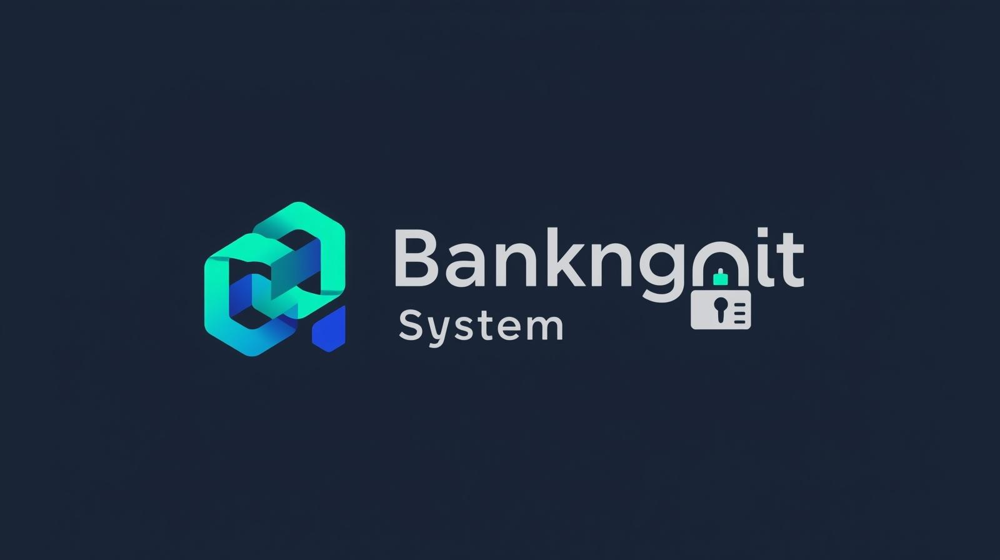

# Banking System API

A Spring Boot backend project that simulates a simple online banking system.

## Features
- Create Account
- Get All Accounts
- Delete Account
- REST API Architecture
- Spring Boot + JPA

## Tech Stack
- Java
- Spring Boot
- Spring Data JPA
- MySQL
- Maven

## API Endpoints

GET /accounts  
POST /accounts  
DELETE /accounts/{id}

Example Request:

{
 "name": "John",
 "balance": 5000
}
## 📬 Postman Collection

[Download Postman Collection](postman/banking-api.postman_collection.json)
## 📸 API Testing

### Get Accounts API

